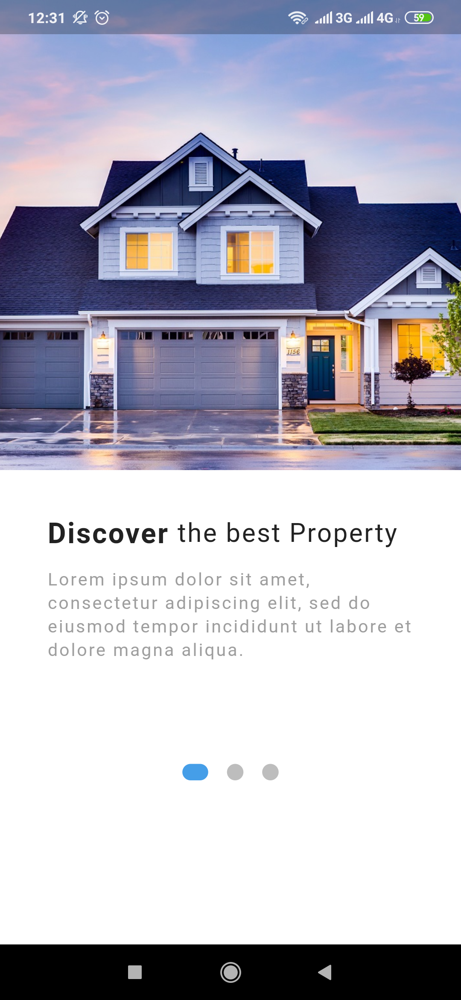

# Real Estate App

#### Highly inspired by :

## Description:

Just a Random UI Implementation with flutter .

## Screenshots:

## Tools & languages:

- VS Code .
- Dart (Logic & Design).
- Flutter (Mobile UI developement kit).

## Others :

- Image Resource : 
